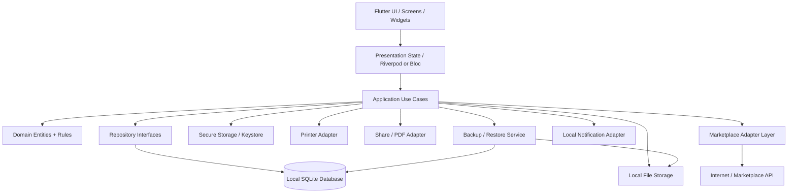
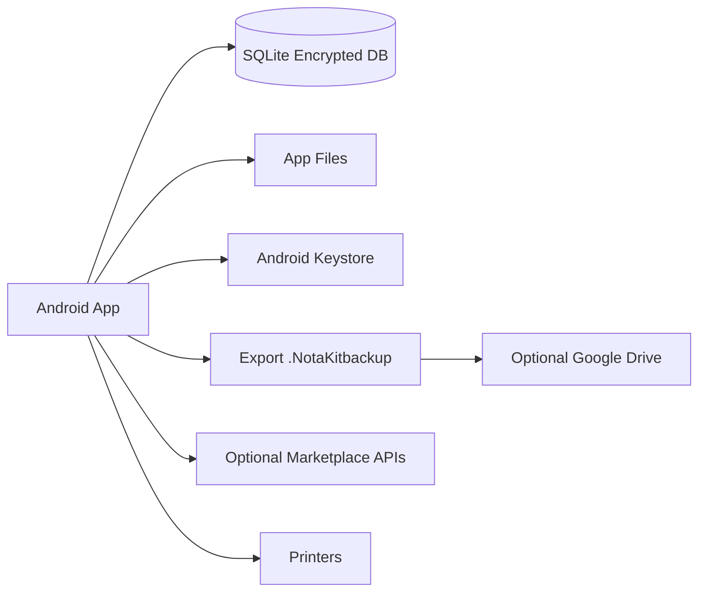
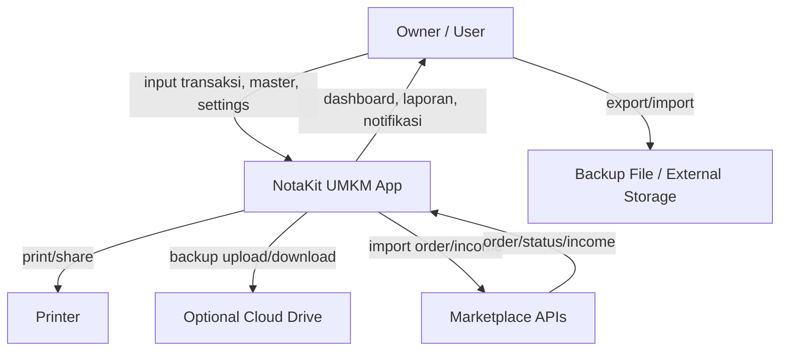
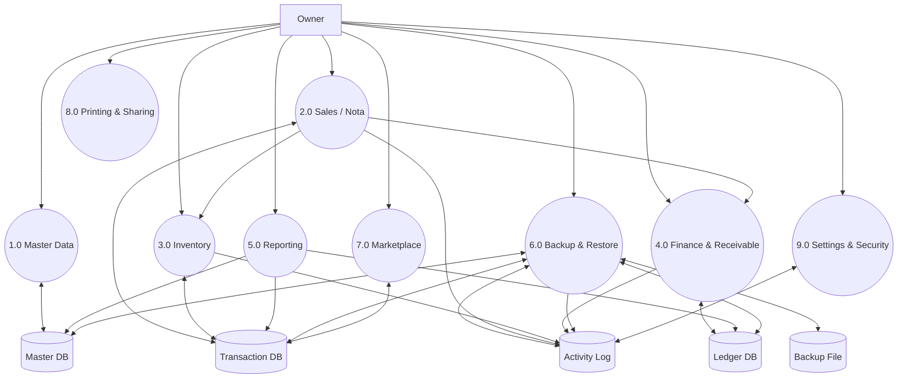
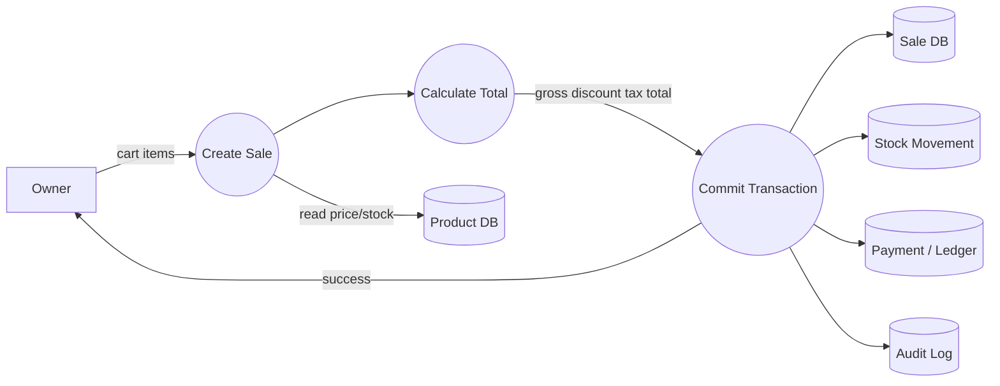
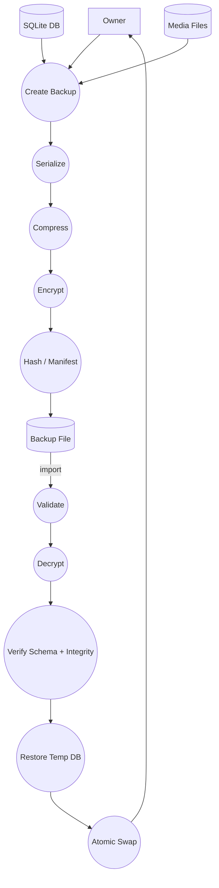
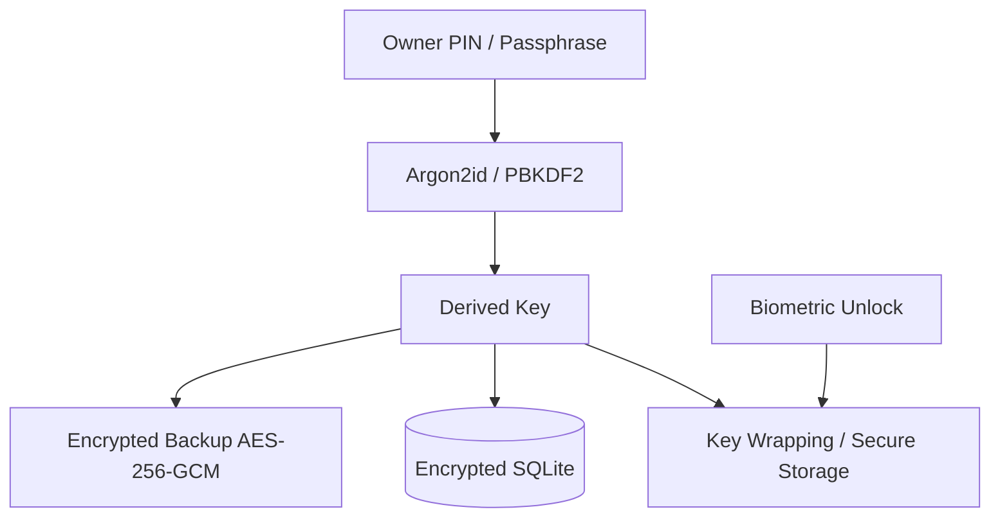
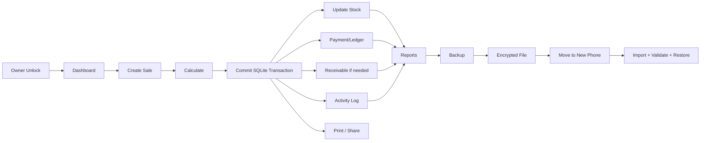

# PRD + SRS + ERD + System Architecture + DFD
## Aplikasi POS / NotaKit Offline-First untuk UMKM (Single Owner)

**Versi:** 1.0.0  
**Target:** Flutter Android (primary), extensible to iOS/Desktop  
**Model penggunaan:** 1 owner / 1 business / tanpa subscription  
**Penyimpanan utama:** lokal di perangkat  
**Migrasi perangkat:** Export/Import backup terenkripsi  
**Status dokumen:** Baseline implementasi untuk coding

> Dokumen ini dirancang sebagai spesifikasi pembangunan aplikasi POS/nota UMKM yang fungsionalnya setara atau melampaui NotaKit yang dirujuk pengguna. Daftar fitur pembanding didasarkan pada halaman Google Play NotaKit yang diperbarui 22 Agustus 2026, termasuk nota/omzet, piutang, barang/harga, produk terlaris, diskon bertingkat, multi-format printer, sharing nota, Excel export, laporan grafik, pelanggan/tipe pelanggan/salesman/varian/harga grosir/konversi satuan, mode restoran/cafe, mode minimarket, NotaKit Online Order, dan import order/income Tokopedia, TikTok Shop, serta Shopee. Pembaruan terbaru juga mencantumkan berat/volume produk, video produk, notifikasi pesanan, dan Analisa Penjualan. citeturn956920view0

---

# 1. Product Requirements Document (PRD)

## 1.1 Tujuan Produk

Membangun aplikasi POS/nota dan manajemen usaha UMKM yang:

1. Dapat dipakai tanpa akun cloud dan tanpa subscription.
2. Menyimpan data utama di perangkat pengguna.
3. Tetap berfungsi ketika offline.
4. Mendukung toko retail, grosir, minimarket, restoran/cafe, laundry, bengkel, dan usaha jasa.
5. Mengelola transaksi, produk, pelanggan, stok, piutang, kas, laporan, pencetakan, dan backup.
6. Memungkinkan pindah HP secara mandiri melalui file backup.
7. Memiliki keamanan lokal sehingga database dan backup dapat dienkripsi.
8. Memiliki integrasi jaringan sebagai fitur opsional, bukan ketergantungan core app.

## 1.2 Sasaran Pengguna

### Persona utama

**Owner UMKM tunggal** yang memakai satu aplikasi untuk operasional toko/usaha.

Kebutuhan utama:
- membuat nota cepat;
- mengetahui omzet dan laba;
- memantau stok;
- mengelola pelanggan dan piutang;
- mencetak/share nota;
- backup dan pindah perangkat;
- melihat laporan tanpa server sendiri.

### Persona usaha

- toko retail;
- grosir/distributor kecil;
- minimarket;
- restoran/cafe;
- laundry;
- bengkel;
- usaha jasa;
- toko online/omnichannel.

## 1.3 Prinsip Produk

- **Local-first:** database lokal adalah source of truth utama.
- **Offline-first:** transaksi utama tidak membutuhkan internet.
- **Single-owner:** satu profil owner dan satu business workspace.
- **No subscription:** tidak ada paket bulanan/tahunan.
- **Portable data:** seluruh data dapat di-export/import.
- **Recoverable:** backup otomatis/manual dan restore harus menjadi fitur kelas satu.
- **Auditability:** perubahan penting tercatat dalam activity log.
- **Idempotency:** import order dan restore tidak boleh menggandakan data.
- **Extensible:** marketplace/printer dapat memakai adapter/plugin internal.

## 1.4 Ruang Lingkup Fitur

### A. Dashboard & Ringkasan

- omzet hari ini;
- omzet periode;
- jumlah transaksi;
- transaksi lunas;
- piutang belum lunas;
- laba kotor;
- laba bersih;
- produk terlaris;
- stok bernilai;
- arus kas;
- shortcut transaksi cepat;
- notifikasi stok menipis;
- notifikasi piutang jatuh tempo;
- notifikasi order masuk (jika integrasi aktif).

### B. Penjualan / Nota

- daftar nota;
- buat nota;
- edit nota;
- hapus/cancel nota dengan proteksi;
- nomor nota otomatis/custom prefix;
- tanggal & jam;
- pelanggan;
- salesman;
- item barang/jasa/non-item;
- qty;
- satuan;
- harga;
- harga grosir;
- diskon nominal;
- diskon persentase;
- diskon bertingkat;
- pajak opsional;
- biaya tambahan;
- biaya pengiriman;
- pembulatan;
- total;
- pembayaran;
- multi-metode pembayaran;
- status lunas/sebagian/belum lunas;
- jatuh tempo;
- memo/catatan;
- nota konsinyasi;
- void/return/refund;
- riwayat perubahan;
- share nota;
- cetak nota;
- duplicate/repeat order.

### C. Produk / Item

- tipe: barang, jasa, non-stock/non-item;
- nama;
- kode/SKU;
- barcode;
- kategori;
- subkategori opsional;
- foto;
- video opsional;
- satuan utama;
- satuan alternatif;
- konversi satuan;
- harga beli/modal;
- harga jual;
- harga grosir;
- tier harga;
- harga berdasarkan tipe pelanggan;
- varian;
- stok;
- minimum stok;
- stok maksimum opsional;
- pemasok;
- berat;
- volume;
- detail pengiriman;
- SKU Tokopedia;
- SKU TikTok Shop;
- SKU Shopee;
- status aktif/nonaktif;
- catatan;
- histori harga.

### D. Inventory

- stok masuk;
- stok keluar;
- stok karena penjualan;
- stok karena retur;
- penyesuaian stok;
- stock opname;
- transfer stok antar lokasi (opsional masa depan);
- kartu stok;
- stok minimum;
- notifikasi stok rendah;
- nilai stok;
- HPP/COGS;
- histori pergerakan stok;
- supplier;
- pembelian/receiving sederhana;
- biaya pembelian;
- batch/lot opsional;
- expiry opsional untuk usaha tertentu.

### E. Pelanggan

- master pelanggan;
- nama;
- alamat;
- telepon;
- WhatsApp;
- email;
- tipe pelanggan;
- salesman;
- limit piutang;
- termin pembayaran;
- saldo piutang;
- jatuh tempo;
- histori transaksi;
- histori pembayaran;
- catatan;
- status aktif/nonaktif.

### F. Supplier

- master supplier;
- kontak;
- alamat;
- telepon;
- email;
- catatan;
- histori pembelian;
- saldo hutang opsional;
- status aktif/nonaktif.

### G. Tipe Pelanggan & Harga

- tipe pelanggan;
- harga retail;
- harga grosir;
- tier harga;
- harga khusus pelanggan;
- diskon default;
- termin default.

### H. Salesman

- master salesman;
- nama;
- telepon;
- status;
- pelanggan yang ditangani;
- transaksi berdasarkan salesman;
- omzet per salesman;
- laba per salesman.

### I. Restoran / Cafe

- mode menu;
- kategori menu;
- item menu;
- varian/topping;
- meja;
- status meja;
- order dine-in/takeaway/delivery;
- split bill;
- merge bill;
- kitchen note;
- cetak order dapur opsional;
- service charge opsional;
- pajak;
- status order.

### J. Minimarket

- kasir cepat;
- scan barcode;
- pencarian cepat;
- shortcut kategori;
- hold/resume transaction;
- multi-payment;
- harga khusus;
- cetak struk;
- retur sederhana;
- stok realtime lokal.

### K. Marketplace & Online Order

Fitur yang harus disiapkan sebagai adapter, dengan core data tetap lokal:

- NotaKit Online Order;
- order masuk;
- status order;
- notifikasi order;
- Tokopedia import order;
- Tokopedia import income;
- TikTok Shop import order;
- TikTok Shop import income;
- Shopee import order;
- Shopee import income;
- mapping SKU marketplace;
- deduplikasi order berdasarkan external order ID;
- sinkronisasi manual;
- log integrasi;
- retry/error queue.

> API resmi marketplace dapat berubah. Implementasi connector harus dipisahkan dari domain core dan diberi feature flag.

### L. Laporan

- dashboard summary;
- omzet;
- penjualan harian;
- penjualan per periode;
- penjualan per produk;
- produk terlaris;
- penjualan per kategori;
- penjualan per pelanggan;
- penjualan per tipe pelanggan;
- penjualan per salesman;
- penjualan per metode pembayaran;
- laba kotor;
- laba bersih;
- HPP;
- arus kas;
- nilai stok;
- stok rendah;
- piutang;
- umur piutang;
- pembelian;
- retur;
- analisa penjualan;
- grafik penjualan;
- grafik laba;
- riwayat aktivitas.

### M. Keuangan Sederhana

- akun kas;
- rekening bank;
- akun pembayaran digital;
- pemasukan;
- pengeluaran;
- transfer antar akun;
- saldo akun;
- piutang;
- pembayaran piutang;
- hutang supplier opsional;
- biaya operasional;
- arus kas;
- rekonsiliasi saldo sederhana.

### N. Printer & Output

Target printer/output:

- thermal 58 mm;
- thermal 80 mm;
- Wi-Fi/network printer A4;
- dot matrix continuous form;
- USB/OTG jika driver/OS mendukung;
- Bluetooth printer jika plugin mendukung;
- PDF;
- image/share;
- WhatsApp;
- email;
- share sheet OS;
- template nota configurable.

### O. Data Management

- export Excel/CSV untuk laporan;
- export full backup JSON;
- export backup terkompresi;
- export backup terenkripsi;
- import backup;
- validate backup;
- preview backup sebelum restore;
- restore penuh;
- restore parsial;
- backup manual;
- backup terjadwal lokal;
- Google Drive backup opsional;
- share backup file;
- checksum/integrity verification;
- versioned backup schema;
- migrasi schema otomatis.

### P. Keamanan & Proteksi

- app lock PIN;
- biometrik;
- PIN untuk operasi sensitif;
- proteksi edit/hapus nota;
- database encryption;
- backup encryption;
- key derivation dari passphrase/PIN;
- secure key storage melalui OS keystore/keychain;
- auto-lock;
- audit log;
- secure delete untuk file sementara;
- ekspor dengan password;
- import dengan password;
- recovery code opsional.

### Q. Pengaturan Toko

- profil toko;
- nama toko;
- alamat;
- telepon;
- email;
- logo;
- footer nota;
- prefix nomor nota;
- format nomor;
- default pajak;
- default diskon;
- mata uang;
- format tanggal/jam;
- pembulatan;
- bahasa;
- tema;
- format printer;
- template nota;
- preferensi stok;
- preferensi harga;
- preferensi pembayaran.

### R. Cloud / Multi-device Opsional

Karena aplikasi target tidak memakai subscription, multi-device tidak menjadi source of truth utama. Implementasi yang disarankan:

- ekspor/import sebagai mekanisme utama pindah perangkat;
- cloud backup opsional ke Google Drive/S3-compatible storage;
- sinkronisasi real-time opsional masa depan;
- konflik data diselesaikan dengan versioning/event timestamp.

---

# 2. Non-Goals

- multi-tenant SaaS;
- subscription billing;
- user marketplace umum;
- sistem payroll lengkap;
- akuntansi double-entry penuh pada MVP;
- ERP penuh;
- server wajib untuk transaksi lokal.

---

# 3. Success Criteria

1. Pengguna dapat membuat nota dalam ≤ 30 detik setelah master data siap.
2. Transaksi inti tetap berfungsi tanpa internet.
3. Tidak ada kehilangan data setelah force-close/restart dalam transaksi yang sudah committed.
4. Backup dapat direstore ke perangkat kedua tanpa server developer.
5. Restore 10.000 transaksi tidak menggandakan data.
6. Laporan menggunakan source transaksi yang sama sehingga angka dapat ditelusuri ke nota.
7. Semua perubahan sensitif masuk audit log.
8. Export full backup dapat dire-import pada versi aplikasi berikutnya melalui schema migration.

---

# 4. Scope MVP vs Phase 2

## MVP (wajib)

- onboarding owner;
- profil toko;
- produk/item;
- kategori;
- satuan & konversi;
- pelanggan & tipe pelanggan;
- supplier;
- salesman;
- harga grosir/tier;
- penjualan/nota;
- pembayaran;
- piutang;
- stok;
- penyesuaian stok;
- laporan dasar;
- kas/bank;
- print 58/80 mm + PDF/share;
- export/import full backup;
- backup terenkripsi;
- app lock;
- audit log;
- settings.

## Phase 2

- restoran/cafe mode;
- minimarket mode lanjutan;
- purchase workflow;
- retur penjualan/pembelian lanjutan;
- stock opname lanjutan;
- Google Drive backup;
- online order;
- marketplace adapters;
- kitchen printing;
- advanced analytics.

## Phase 3

- optional cross-device sync;
- advanced accounting;
- advanced inventory batch/expiry;
- plugin connector marketplace.

---

# 5. Software Requirements Specification (SRS)

## 5.1 Functional Requirements

### FR-AUTH-001 Onboarding Owner

Sistem harus memungkinkan user membuat profil owner pertama kali.

Input minimal:
- nama owner;
- nama usaha;
- PIN;
- opsi biometrik;
- timezone;
- currency.

Acceptance:
- hanya satu owner aktif.
- aplikasi dapat dibuka setelah setup tanpa internet.

### FR-STORE-001 Store Profile

Sistem harus menyimpan profil usaha dan menampilkannya pada output nota.

### FR-PROD-001 Product CRUD

Sistem harus menyediakan create/read/update/archive item.

Rules:
- SKU/barcode dapat diberi unique constraint;
- item jasa tidak mengurangi stok;
- non-stock item tidak mengurangi stok;
- item inactive tidak dapat dijual kecuali transaksi historis.

### FR-PROD-002 Variant

Varian dapat memiliki kode/SKU, harga dan stok sendiri atau inherit dari parent.

### FR-PROD-003 Unit Conversion

Sistem harus mendukung conversion factor.

Contoh:

`1 dus = 24 pcs`

Jika dijual 2 dus, stok berkurang 48 pcs base unit.

### FR-PRICE-001 Customer Tier Pricing

Harga dapat ditentukan berdasarkan:
- price tier;
- customer type;
- customer override;
- quantity break opsional.

Prioritas harga:

`customer override > tier/customer type > promo/wholesale rule > standard price`.

### FR-SALES-001 Create Sale

Sistem harus membuat sale dengan immutable transaction number.

Line wajib memiliki snapshot:
- nama produk;
- SKU;
- unit;
- unit price;
- discount;
- tax;
- HPP saat transaksi.

Tujuannya agar histori tidak berubah ketika master produk berubah.

### FR-SALES-002 Payment

Status:

`DRAFT -> OPEN -> PARTIAL -> PAID`

Atau:

`OPEN -> VOID`

Retur tidak menghapus transaksi asal.

### FR-SALES-003 Discount

Dukung:
- nominal;
- persentase;
- bertingkat.

Rumus default diskon bertingkat:

`net = (gross × (1-d1)) × (1-d2) - fixed_discount`

Dengan guard bahwa net tidak boleh negatif.

### FR-STOCK-001 Stock Movement

Setiap perubahan stok harus membuat stock movement.

Tipe minimal:
- PURCHASE_IN;
- SALE_OUT;
- SALES_RETURN_IN;
- PURCHASE_RETURN_OUT;
- ADJUSTMENT_IN;
- ADJUSTMENT_OUT;
- STOCK_OPNAME;
- OPENING_BALANCE.

### FR-STOCK-002 Atomic Transaction

Penyimpanan sale dan stock movement harus satu database transaction.

Tidak boleh ada kondisi:
- nota committed tetapi stok gagal;
- stok berkurang tetapi nota gagal.

### FR-AR-001 Receivable

Jika pembayaran < total, sistem membuat receivable balance.

### FR-CASH-001 Cash Ledger

Setiap payment, expense, income manual dan transfer menghasilkan ledger entry.

### FR-REPORT-001 Reports

Laporan dihitung dari normalized transaction data dan ledger, bukan dari nilai cache tanpa rekonsiliasi.

### FR-PRINT-001 Receipt

Output harus dapat dirender ke:
- thermal 58;
- thermal 80;
- A4;
- PDF.

### FR-BACKUP-001 Full Backup

Backup harus mencakup:
- database;
- schema version;
- app version;
- metadata;
- media references/files yang dipilih;
- checksum.

### FR-BACKUP-002 Encrypted Backup

Format yang disarankan:

```text
.NotaKitbackup
```

Container:

```text
magic
format_version
kdf_parameters
salt
nonce
ciphertext
authentication_tag
checksum/manifest
```

Kriptografi:
- AES-256-GCM untuk confidentiality + integrity;
- Argon2id atau PBKDF2-HMAC-SHA256 untuk derivasi kunci;
- random salt;
- random nonce;
- tidak pernah hard-code key.

### FR-BACKUP-003 Import/Restore

Restore harus melakukan:

1. validate file;
2. decrypt;
3. verify auth tag/checksum;
4. validate schema;
5. preview counts;
6. user confirmation;
7. write to temporary database;
8. integrity checks;
9. atomic replace/merge;
10. create restore audit event.

### FR-AUDIT-001 Activity Log

Operasi berikut minimal diaudit:
- login/unlock;
- create/update/delete/archive product;
- create/edit/void sale;
- payment;
- stock adjustment;
- backup;
- restore;
- import/export;
- settings sensitif.

### FR-MKT-001 Marketplace Import

External order wajib memiliki:
- provider;
- external order ID;
- external order timestamp;
- payload hash.

Unique key:
`provider + external_order_id`.

### FR-NOTIF-001 Notifications

Local notifications:
- stock low;
- due receivable;
- pending online order;
- failed backup;
- backup overdue.

### FR-REST-001 Restaurant Mode

Restaurant order dapat mempunyai table, order type, kitchen status dan split/merge bill.

### FR-MINI-001 Minimarket Mode

Minimarket mode mengutamakan barcode scanning, rapid checkout dan receipt printing.

---

# 6. Non-Functional Requirements

## NFR-001 Performance

- startup cold < 3 detik pada device kelas menengah dengan database normal;
- pencarian produk < 200 ms target pada 10.000 item;
- checkout < 500 ms target setelah scan/input selesai;
- report harian < 2 detik target pada 100.000 sale line dengan indexing yang tepat.

## NFR-002 Reliability

- database transaction atomic;
- WAL mode jika engine mendukung;
- crash-safe commit;
- backup sebelum destructive restore.

## NFR-003 Security

- local DB encrypted;
- secrets di secure storage;
- no plaintext backup password;
- audit trail;
- lock screen;
- least privilege permissions.

## NFR-004 Portability

- Android menjadi platform utama;
- Flutter architecture harus menjaga business logic platform-independent;
- printer abstraction harus memisahkan Android transport dari domain.

## NFR-005 Maintainability

Direkomendasikan:
- Clean Architecture / modular architecture;
- repository pattern;
- use-case/service layer;
- generated DB models;
- unit tests + integration tests.

---

# 7. ERD

## 7.1 Entitas Utama

```mermaid
 erDiagram
    OWNER ||--|| BUSINESS : owns
    BUSINESS ||--o{ CATEGORY : has
    BUSINESS ||--o{ UNIT : defines
    BUSINESS ||--o{ PRODUCT : owns
    PRODUCT ||--o{ PRODUCT_VARIANT : has
    PRODUCT ||--o{ PRODUCT_UNIT : supports
    UNIT ||--o{ PRODUCT_UNIT : maps
    BUSINESS ||--o{ SUPPLIER : has
    BUSINESS ||--o{ CUSTOMER_TYPE : has
    CUSTOMER_TYPE ||--o{ CUSTOMER : groups
    BUSINESS ||--o{ CUSTOMER : has
    BUSINESS ||--o{ SALESMAN : has
    SALESMAN ||--o{ CUSTOMER : handles
    BUSINESS ||--o{ PRICE_TIER : has
    PRICE_TIER ||--o{ PRODUCT_PRICE : defines
    PRODUCT ||--o{ PRODUCT_PRICE : priced
    CUSTOMER_TYPE ||--o{ PRODUCT_PRICE : can_use
    CUSTOMER ||--o{ CUSTOMER_PRICE : overrides
    PRODUCT ||--o{ CUSTOMER_PRICE : overrides
    BUSINESS ||--o{ SALE : creates
    CUSTOMER ||--o{ SALE : buys
    SALESMAN ||--o{ SALE : handles
    SALE ||--|{ SALE_LINE : contains
    PRODUCT ||--o{ SALE_LINE : sold_as
    PRODUCT_VARIANT ||--o{ SALE_LINE : variant
    SALE ||--o{ PAYMENT : receives
    ACCOUNT ||--o{ PAYMENT : receives_into
    SALE ||--o{ RECEIVABLE : creates
    CUSTOMER ||--o{ RECEIVABLE : owes
    RECEIVABLE ||--o{ RECEIVABLE_PAYMENT : settled_by
    PAYMENT ||--o{ RECEIVABLE_PAYMENT : applied
    BUSINESS ||--o{ ACCOUNT : owns
    ACCOUNT ||--o{ LEDGER_ENTRY : posts
    BUSINESS ||--o{ EXPENSE : records
    PRODUCT ||--o{ STOCK_MOVEMENT : moves
    BUSINESS ||--o{ STOCK_MOVEMENT : owns
    SALE ||--o{ STOCK_MOVEMENT : causes
    SUPPLIER ||--o{ PURCHASE : supplies
    PURCHASE ||--|{ PURCHASE_LINE : contains
    PRODUCT ||--o{ PURCHASE_LINE : purchased
    PURCHASE ||--o{ PURCHASE_PAYMENT : paid_by
    ACCOUNT ||--o{ PURCHASE_PAYMENT : paid_from
    BUSINESS ||--o{ SALES_RETURN : receives
    SALE ||--o{ SALES_RETURN : references
    SALES_RETURN ||--|{ SALES_RETURN_LINE : contains
    PRODUCT ||--o{ SALES_RETURN_LINE : returned
    BUSINESS ||--o{ ACTIVITY_LOG : records
    BUSINESS ||--o{ BACKUP_RECORD : creates
    BUSINESS ||--o{ MARKETPLACE_ACCOUNT : connects
    MARKETPLACE_ACCOUNT ||--o{ MARKETPLACE_ORDER : imports
    MARKETPLACE_ORDER ||--|{ MARKETPLACE_ORDER_LINE : contains
    PRODUCT ||--o{ MARKETPLACE_ORDER_LINE : maps
    BUSINESS ||--o{ APP_SETTING : configures
    BUSINESS ||--o{ PRINTER_PROFILE : configures
    BUSINESS ||--o{ NOTIFICATION : receives
```



## 7.2 Detail Field Schema

### OWNER
- id PK
- name
- phone
- email
- created_at
- updated_at

### BUSINESS
- id PK
- owner_id FK UNIQUE
- name
- address
- phone
- email
- logo_path
- currency
- timezone
- invoice_prefix
- invoice_sequence
- created_at
- updated_at

### CATEGORY
- id PK
- business_id FK
- parent_id nullable FK self
- name
- sort_order
- is_active
- created_at
- updated_at

### UNIT
- id PK
- business_id FK
- code
- name
- symbol
- decimal_scale
- is_active

### PRODUCT
- id PK
- business_id FK
- category_id FK nullable
- supplier_id FK nullable
- type ENUM(goods,service,non_stock)
- sku
- barcode nullable
- name
- description
- photo_path nullable
- video_path nullable
- base_unit_id FK
- cost_price
- sale_price
- wholesale_price nullable
- min_stock
- max_stock nullable
- weight nullable
- volume nullable
- shipping_note nullable
- marketplace_sku_tokopedia nullable
- marketplace_sku_tiktok nullable
- marketplace_sku_shopee nullable
- track_stock boolean
- is_active
- created_at
- updated_at
- archived_at nullable

### PRODUCT_VARIANT
- id PK
- product_id FK
- sku
- barcode nullable
- name
- cost_price nullable
- sale_price nullable
- stock_quantity
- is_active

### PRODUCT_UNIT
- id PK
- product_id FK
- unit_id FK
- conversion_to_base DECIMAL
- sale_price_override nullable
- purchase_price_override nullable

### CUSTOMER_TYPE
- id PK
- business_id FK
- name
- default_discount_type
- default_discount_value
- default_price_tier_id FK nullable
- default_payment_term_days
- is_active

### CUSTOMER
- id PK
- business_id FK
- customer_type_id FK nullable
- salesman_id FK nullable
- name
- address
- phone
- whatsapp
- email
- credit_limit
- payment_term_days
- notes
- is_active
- created_at
- updated_at

### SALESMAN
- id PK
- business_id FK
- code
- name
- phone
- is_active

### PRICE_TIER
- id PK
- business_id FK
- name
- priority
- is_active

### PRODUCT_PRICE
- id PK
- product_id FK
- price_tier_id FK nullable
- customer_type_id FK nullable
- unit_id FK nullable
- variant_id FK nullable
- min_qty nullable
- price
- valid_from
- valid_to nullable

### CUSTOMER_PRICE
- id PK
- customer_id FK
- product_id FK
- variant_id FK nullable
- unit_id FK nullable
- min_qty nullable
- price
- valid_from
- valid_to nullable

### SALE
- id PK
- business_id FK
- customer_id FK nullable
- salesman_id FK nullable
- number UNIQUE per business
- status ENUM(draft,open,partial,paid,void,returned,completed)
- sale_type ENUM(retail,wholesale,restaurant,online,minimarket)
- order_type nullable
- subtotal
- discount_total
- tax_total
- service_charge
- shipping_fee
- rounding
- grand_total
- paid_total
- due_total
- due_date nullable
- note
- created_at
- updated_at
- finalized_at nullable
- voided_at nullable

### SALE_LINE
- id PK
- sale_id FK
- product_id FK nullable
- variant_id FK nullable
- product_name_snapshot
- sku_snapshot
- unit_name_snapshot
- qty
- unit_price
- discount_amount
- tax_amount
- cost_price_snapshot
- line_total
- note

### PAYMENT
- id PK
- sale_id FK nullable
- purchase_id FK nullable
- account_id FK
- payment_method ENUM(cash,bank,ewallet,card,other)
- amount
- reference_number nullable
- paid_at
- note

### RECEIVABLE
- id PK
- sale_id FK UNIQUE
- customer_id FK
- original_amount
- paid_amount
- remaining_amount
- due_date
- status
- created_at
- closed_at nullable

### RECEIVABLE_PAYMENT
- id PK
- receivable_id FK
- payment_id FK
- amount_applied

### ACCOUNT
- id PK
- business_id FK
- name
- type ENUM(cash,bank,ewallet,other)
- account_number nullable
- opening_balance
- current_balance
- is_active

### LEDGER_ENTRY
- id PK
- account_id FK
- source_type
- source_id
- entry_type ENUM(debit,credit)
- amount
- occurred_at
- note

### EXPENSE
- id PK
- business_id FK
- account_id FK
- category
- amount
- occurred_at
- note

### STOCK_MOVEMENT
- id PK
- business_id FK
- product_id FK
- variant_id FK nullable
- sale_id FK nullable
- purchase_id FK nullable
- movement_type
- quantity_base
- unit_cost
- reference_number
- occurred_at
- note

### PURCHASE
- id PK
- business_id FK
- supplier_id FK nullable
- number
- status
- subtotal
- discount_total
- tax_total
- grand_total
- paid_total
- due_total
- note
- created_at
- finalized_at nullable

### PURCHASE_LINE
- id PK
- purchase_id FK
- product_id FK
- variant_id FK nullable
- qty
- unit_id FK
- unit_cost
- discount_amount
- line_total

### PURCHASE_PAYMENT
- id PK
- purchase_id FK
- account_id FK
- amount
- paid_at

### SALES_RETURN
- id PK
- business_id FK
- sale_id FK
- number
- reason
- total
- created_at

### SALES_RETURN_LINE
- id PK
- sales_return_id FK
- sale_line_id FK
- product_id FK
- variant_id FK nullable
- qty
- amount

### ACTIVITY_LOG
- id PK
- business_id FK
- actor_type ENUM(owner,system)
- action
- entity_type
- entity_id
- before_json nullable
- after_json nullable
- created_at
- device_id

### BACKUP_RECORD
- id PK
- business_id FK
- file_name
- format_version
- app_version
- encrypted boolean
- size_bytes
- checksum
- created_at
- source_device_id
- location_type ENUM(local,drive,share)

### MARKETPLACE_ACCOUNT
- id PK
- business_id FK
- provider
- account_name
- credential_ref
- is_active
- last_sync_at

### MARKETPLACE_ORDER
- id PK
- marketplace_account_id FK
- external_order_id
- external_status
- order_time
- customer_name_snapshot
- total_amount
- raw_payload_hash
- imported_at
- status

Unique constraint: `(marketplace_account_id, external_order_id)`.

### MARKETPLACE_ORDER_LINE
- id PK
- marketplace_order_id FK
- product_id FK nullable
- external_sku
- product_name_snapshot
- qty
- unit_price
- line_total

### APP_SETTING
- id PK
- business_id FK
- key UNIQUE per business
- value_json_encrypted
- updated_at

### PRINTER_PROFILE
- id PK
- business_id FK
- name
- printer_type
- paper_width
- connection_type
- connection_config_encrypted
- template_id
- is_default

### NOTIFICATION
- id PK
- business_id FK
- type
- title
- body
- reference_type nullable
- reference_id nullable
- is_read
- created_at

---

# 8. Database Rules

## 8.1 Money

Simpan uang sebagai integer minor units, bukan floating-point.

Contoh IDR:

`amount_minor = 125000`.

Jika mata uang memiliki decimal places, simpan `currency_scale` pada business/settings.

## 8.2 Quantity

Gunakan DECIMAL/FIXED precision agar mendukung:
- 0.5 kg;
- 1.25 liter;
- 2 dus.

## 8.3 Soft Delete

Master data memakai archive/soft delete. Data transaksi tidak boleh benar-benar dihapus setelah final.

---

# 9. System Architecture

## 9.1 Arsitektur Logical



## 9.2 Flutter Layering

Direkomendasikan struktur:

```text
lib/
├── app/
│   ├── app.dart
│   ├── router.dart
│   ├── theme/
│   └── bootstrap/
├── core/
│   ├── error/
│   ├── result/
│   ├── money/
│   ├── date_time/
│   ├── security/
│   ├── database/
│   ├── backup/
│   ├── printing/
│   ├── files/
│   └── logging/
├── features/
│   ├── dashboard/
│   ├── sales/
│   ├── products/
│   ├── inventory/
│   ├── customers/
│   ├── suppliers/
│   ├── salesmen/
│   ├── pricing/
│   ├── purchases/
│   ├── receivables/
│   ├── finance/
│   ├── reports/
│   ├── restaurants/
│   ├── minimarket/
│   ├── marketplace/
│   ├── printing/
│   ├── backup_restore/
│   ├── settings/
│   ├── security/
│   └── activity_log/
└── shared/
    ├── widgets/
    ├── formatters/
    └── extensions/
```

## 9.3 Recommended Flutter Stack

- Flutter + Dart;
- Riverpod atau Bloc untuk state management;
- Drift atau Isar untuk persistence, dengan **Drift + SQLite** sebagai pilihan utama untuk transaksi relational kompleks;
- Freezed/json_serializable untuk immutable models/serialization;
- go_router untuk navigation;
- flutter_secure_storage untuk secret/key wrapping;
- local_auth untuk biometric;
- path_provider untuk local paths;
- share_plus untuk sharing;
- pdf + printing untuk PDF/A4/rendering;
- mobile_scanner atau barcode scanning plugin;
- local_notifications package untuk local notification.

> Pilih satu stack state-management dan satu database layer pada implementasi; jangan mencampur dua ORM/database utama.

---

# 10. Deployment Architecture



Core transaksi tidak tergantung G atau P.

---

# 11. Data Flow Diagram (DFD)

## 11.1 Context Diagram



## 11.2 DFD Level 0



## 11.3 DFD Penjualan



## 11.4 DFD Backup



---

# 12. Core Workflow

## 12.1 Penjualan Normal

```text
Open App
 -> Unlock
 -> New Sale
 -> Select Customer (optional)
 -> Scan/Search Product
 -> Select Unit/Variant
 -> Set Qty
 -> Apply Price Tier
 -> Apply Discount
 -> Apply Tax/Service Fee
 -> Payment
 -> Finalize
 -> Atomic commit
    -> Sale saved
    -> Stock movement created
    -> Payment ledger created
    -> Receivable created if needed
    -> Activity log created
 -> Print/Share
```

## 12.2 Pindah HP

```text
HP Lama
  -> Settings
  -> Backup / Export
  -> Full Backup
  -> Encrypt with password
  -> Generate .NotaKitbackup
  -> transfer via cable/Drive/Share

HP Baru
  -> Install app
  -> Import backup
  -> Enter password
  -> Validate
  -> Preview data counts
  -> Confirm restore
  -> Restore
  -> Rebuild indexes/cache
  -> Verify reports
```

---

# 13. Backup File Specification

## 13.1 Format Container

Disarankan memakai ZIP-like container dengan manifest, tetapi **payload database tetap terenkripsi**.

```text
NOTAKIT_BACKUP/
├── manifest.json
├── database.sqlite.enc
├── media/
│   ├── images.enc
│   └── videos.enc
└── checksum.json
```

Untuk security lebih baik, seluruh archive dapat dienkripsi sebagai satu blob:

```text
.NotaKitbackup
└── AEAD encrypted container
```

## 13.2 Manifest

```json
{
  "format": "NotaKit-backup",
  "version": 1,
  "app_version": "1.0.0",
  "schema_version": 1,
  "created_at": "2026-01-01T00:00:00Z",
  "business_name": "Example Store",
  "encrypted": true,
  "compression": "zstd-or-deflate",
  "cipher": "AES-256-GCM",
  "kdf": "Argon2id",
  "record_counts": {
    "products": 0,
    "customers": 0,
    "sales": 0,
    "stock_movements": 0
  }
}
```

Jangan menaruh PIN/password di manifest.

---

# 14. Security Architecture



### Aturan penting

1. Password tidak disimpan plaintext.
2. DB key tidak diletakkan hard-coded di source.
3. Salt dan nonce harus random.
4. Authenticated encryption wajib diverifikasi sebelum decrypt result dipakai.
5. Export backup tanpa password diberi label **unencrypted** dan hanya tersedia jika user sengaja mengaktifkan opsi tersebut.
6. Default adalah encrypted backup.

---

# 15. Index & Constraint Strategy

Index minimum:

```text
products(business_id, name)
products(business_id, sku)
products(business_id, barcode)
products(business_id, is_active)
customers(business_id, name)
customers(business_id, phone)
sales(business_id, number)
sales(business_id, created_at)
sales(business_id, customer_id, created_at)
sale_lines(sale_id)
stock_movements(product_id, occurred_at)
receivables(customer_id, status, due_date)
payments(paid_at)
ledger_entries(account_id, occurred_at)
marketplace_orders(account_id, external_order_id) UNIQUE
activity_logs(business_id, created_at)
```

Foreign key enforcement wajib aktif.

---

# 16. State Machines

## Sale

```text
DRAFT
  -> OPEN
  -> PARTIAL
  -> PAID
  -> COMPLETED

OPEN/PARTIAL/PAID
  -> VOID (hanya lewat authorized action)

PAID/COMPLETED
  -> RETURNED (melalui return document, bukan delete)
```

## Receivable

```text
OPEN -> PARTIAL -> PAID
OPEN -> OVERDUE
OVERDUE -> PARTIAL -> PAID
```

## Marketplace Order

```text
IMPORTED
 -> CONFIRMED
 -> PACKED
 -> SHIPPED
 -> COMPLETED

IMPORTED -> CANCELLED
```

---

# 17. Accounting / HPP Rules

Untuk laporan laba sederhana:

`Gross Profit = Sales Net - COGS`

`Net Profit = Gross Profit - Operating Expenses`

COGS saat penjualan:

`COGS = Σ(qty_base × cost_price_snapshot)`

Gunakan cost snapshot pada sale line untuk histori, dan gunakan inventory costing policy yang konsisten.

MVP dapat memakai **weighted average cost**.

Weighted average:

`new_avg = ((old_qty × old_cost) + (purchase_qty × purchase_cost)) / (old_qty + purchase_qty)`

Untuk metode FIFO/perpetual costing, dapat disiapkan pada Phase 3.

---

# 18. UI / Information Architecture

```text
Dashboard
├── Ringkasan
├── Penjualan Hari Ini
├── Produk Terlaris
├── Piutang
└── Stok Rendah

Penjualan
├── Semua Nota
├── Belum Lunas
├── Retur
└── Buat Nota

Item
├── Semua Item
├── Kategori
├── Satuan
├── Harga Grosir
├── Varian
└── Supplier

Pelanggan
├── Pelanggan
├── Tipe Pelanggan
└── Salesman

Inventory
├── Stok
├── Stok Masuk
├── Penyesuaian
├── Stock Opname
└── Kartu Stok

Pembelian
├── Purchase
├── Supplier
└── Hutang (opsional)

Keuangan
├── Kas
├── Bank
├── Pemasukan
├── Pengeluaran
├── Piutang
└── Arus Kas

Laporan
├── Summary
├── Penjualan
├── Analisa Penjualan
├── Laba Penjualan
├── Laba Bersih
├── Produk Terlaris
├── Nilai Stok
├── Arus Kas
└── Riwayat Aktivitas

Marketplace
├── Online Order
├── Tokopedia
├── TikTok Shop
└── Shopee

Pengaturan
├── Toko Saya
├── Rekening Toko
├── Printer
├── Preferensi
├── Keamanan
├── Backup / Restore
├── Cloud Backup
└── Export / Import
```

---

# 19. API / Integration Boundary

Core tidak harus mempunyai HTTP API.

Untuk connector online, gunakan interface:

```dart
abstract interface class MarketplaceAdapter {
  Future<List<ExternalOrder>> fetchOrders(SyncCursor cursor);
  Future<List<ExternalIncome>> fetchIncome(SyncCursor cursor);
  Future<SyncResult> pushStatus(String externalOrderId, String status);
}
```

Implementasi:

```text
TokopediaAdapter
TikTokShopAdapter
ShopeeAdapter
OnlineOrderAdapter
```

Printer:

```dart
abstract interface class PrinterAdapter {
  Future<PrinterConnectionResult> connect();
  Future<void> printReceipt(ReceiptDocument document);
  Future<void> printA4(Document document);
}
```

---

# 20. Error Handling

Setiap use case harus mengembalikan typed result:

```text
Success(data)
Failure(code, message, cause)
```

Error codes minimal:

- AUTH_LOCKED
- INVALID_PIN
- PRODUCT_NOT_FOUND
- PRODUCT_INACTIVE
- STOCK_INSUFFICIENT
- INVALID_QUANTITY
- INVALID_DISCOUNT
- INVALID_PAYMENT
- RECEIVABLE_LIMIT_EXCEEDED
- DUPLICATE_TRANSACTION
- BACKUP_INVALID
- BACKUP_WRONG_PASSWORD
- BACKUP_SCHEMA_UNSUPPORTED
- BACKUP_CORRUPTED
- MARKETPLACE_UNAUTHORIZED
- MARKETPLACE_RATE_LIMITED
- MARKETPLACE_DUPLICATE_ORDER
- PRINTER_NOT_FOUND
- PRINTER_CONNECTION_FAILED
- DATABASE_ERROR

---

# 21. Testing Strategy

## Unit Test

- price calculation;
- discount levels;
- tax;
- rounding;
- unit conversion;
- stock calculation;
- weighted average cost;
- receivable calculation;
- ledger balance;
- report aggregation;
- backup encryption/decryption.

## Integration Test

- create sale + stock + payment atomically;
- partial payment;
- return;
- purchase + stock in;
- restore backup;
- duplicate marketplace order;
- print rendering;
- database migration.

## Golden/UI Test

- thermal 58 receipt;
- thermal 80 receipt;
- A4 invoice;
- dark/light theme;
- barcode checkout.

## Recovery Test

- force-close after transaction;
- battery loss simulation;
- corrupted backup;
- wrong password;
- interrupted restore;
- schema upgrade from v1 to v2.

---

# 22. Acceptance Test Checklist

## Onboarding

- [ ] Owner dapat dibuat tanpa internet.
- [ ] Toko dapat dibuat.
- [ ] PIN dapat dibuat.
- [ ] Biometric dapat diaktifkan.

## Product

- [ ] Barang dapat dibuat.
- [ ] Jasa dapat dibuat.
- [ ] Non-stock dapat dibuat.
- [ ] Barcode dapat disimpan.
- [ ] Varian berfungsi.
- [ ] Satuan dan konversi benar.
- [ ] Harga grosir benar.
- [ ] Harga per tipe pelanggan benar.
- [ ] SKU marketplace tersimpan.
- [ ] Berat/volume tersimpan.
- [ ] Foto/video dapat dikelola.

## Sales

- [ ] Nota dapat dibuat.
- [ ] Discount nominal.
- [ ] Discount persen.
- [ ] Discount bertingkat.
- [ ] Payment penuh.
- [ ] Payment sebagian.
- [ ] Piutang dibuat otomatis.
- [ ] Stok berkurang atomically.
- [ ] Nota dapat dicetak.
- [ ] Nota dapat dibagikan.
- [ ] Void memakai audit.
- [ ] Return tidak menghapus transaksi asal.

## Inventory

- [ ] Stok masuk.
- [ ] Stok keluar.
- [ ] Adjustment.
- [ ] Stock opname.
- [ ] Kartu stok.
- [ ] Nilai stok.
- [ ] Low-stock notification.

## Finance

- [ ] Kas.
- [ ] Bank.
- [ ] Pemasukan.
- [ ] Pengeluaran.
- [ ] Transfer.
- [ ] Piutang.
- [ ] Payment allocation.

## Reports

- [ ] Summary.
- [ ] Rekap harian.
- [ ] Laba penjualan.
- [ ] Laba bersih.
- [ ] Arus kas.
- [ ] Nilai stok.
- [ ] Produk terlaris.
- [ ] Analisa penjualan.
- [ ] Riwayat aktivitas.

## Backup

- [ ] Full export JSON.
- [ ] Full export encrypted.
- [ ] Import backup.
- [ ] Wrong password rejected.
- [ ] Corrupted backup rejected.
- [ ] Schema migration.
- [ ] Restore does not duplicate.
- [ ] User gets preview before destructive restore.

## Marketplace

- [ ] External order import.
- [ ] Income import.
- [ ] SKU mapping.
- [ ] Duplicate prevention.
- [ ] Retry failed sync.
- [ ] Sync log.

## Printer

- [ ] 58mm.
- [ ] 80mm.
- [ ] PDF.
- [ ] A4.
- [ ] Share.
- [ ] Bluetooth where supported.
- [ ] Network/Wi-Fi where supported.
- [ ] USB/OTG where supported by Android/plugin.

---

# 23. Migration & Versioning

Schema memiliki angka:

`schema_version = 1, 2, 3, ...`

Aturan:

- migration harus forward-only;
- setiap release menyimpan migration script;
- backup selalu menyimpan schema_version;
- import lama harus melalui migration sebelum digunakan;
- destructive migration harus membuat backup otomatis.

Contoh:

```text
Backup v1
  -> detect schema v1
  -> migrate v1 -> v2
  -> migrate v2 -> v3
  -> validate
  -> restore
```

---

# 24. Recommended Development Order

## Sprint 1

- project bootstrap;
- database;
- migration;
- owner/store;
- security;
- settings.

## Sprint 2

- category/unit;
- products;
- customer;
- supplier;
- salesman;
- pricing.

## Sprint 3

- cart;
- sale;
- payment;
- receipt;
- stock atomicity.

## Sprint 4

- inventory;
- purchase;
- receivable;
- finance ledger.

## Sprint 5

- reports;
- dashboard;
- activity log.

## Sprint 6

- PDF;
- 58/80 printer;
- sharing;
- barcode scanning.

## Sprint 7

- backup;
- encrypted migration;
- restore;
- schema versioning.

## Sprint 8

- restaurant mode;
- minimarket mode.

## Sprint 9

- marketplace adapter;
- online order;
- notifications.

## Sprint 10

- hardening;
- profiling;
- integration test;
- release build;
- migration test.

---

# 25. Definition of Done

Sebuah fitur dianggap selesai bila:

1. UI selesai.
2. Domain rule selesai.
3. DB schema/migration selesai.
4. Repository selesai.
5. Error state ditangani.
6. Loading state ditangani.
7. Audit log diterapkan untuk operasi sensitif.
8. Unit test tersedia.
9. Integration test tersedia bila menyentuh transaksi.
10. Backup/restore compatibility diuji.
11. Tidak ada data mutation langsung dari widget tanpa melalui use case/repository.

---

# 26. Catatan Implementasi Kritis

## 26.1 Jangan menjadikan UI sebagai business logic

Jangan menghitung laba, stok, diskon atau piutang hanya di widget. Semua aturan harus berada di domain/application layer.

## 26.2 Jangan menyimpan total tanpa source line

Total pada sale boleh di-cache, tetapi harus dapat direkonstruksi dari sale lines.

## 26.3 Jangan menghapus transaksi final

Gunakan void/return.

## 26.4 Semua stock movement harus auditable

Stok bukan sekadar angka `products.stock` yang diubah manual. Gunakan movement ledger lalu boleh memiliki cached balance.

## 26.5 Snapshot transaksi

Nama produk/harga/HPP/unit harus disalin ke sale line saat transaksi final agar histori stabil.

## 26.6 Backup bukan sekadar export tabel

Backup harus memiliki:
- schema version;
- migration compatibility;
- integrity check;
- encryption;
- media handling;
- transactional restore.

## 26.7 Marketplace jangan dicampur dengan core sales

External order harus masuk melalui staging/import layer. Setelah valid, baru diposting menjadi local sale.

---

# 27. Traceability Matrix Ringkas

| Kebutuhan | Modul | Entitas Utama | Test |
|---|---|---|---|
| Nota | Sales | SALE, SALE_LINE | sales integration |
| Piutang | Receivable | RECEIVABLE | receivable test |
| Stok | Inventory | STOCK_MOVEMENT | inventory test |
| Harga grosir | Pricing | PRICE_TIER, PRODUCT_PRICE | pricing test |
| Pelanggan | CRM | CUSTOMER | customer test |
| Salesman | CRM | SALESMAN | salesman test |
| Laporan | Reporting | SALE, LEDGER, STOCK_MOVEMENT | report test |
| Kas/bank | Finance | ACCOUNT, LEDGER_ENTRY | ledger test |
| Backup | Backup | BACKUP_RECORD | crypto/restore test |
| Marketplace | Integration | MARKETPLACE_* | idempotency test |
| Printer | Output | PRINTER_PROFILE | render test |
| Audit | Security | ACTIVITY_LOG | audit test |

---

# 28. Reference Feature Completeness

Fitur pembanding yang wajib tercakup dari NotaKit publik:

- [x] Daftar nota & omzet
- [x] Piutang / nota belum lunas
- [x] Barang & harga
- [x] Produk terlaris
- [x] Diskon biasa
- [x] Diskon bertingkat
- [x] Thermal 58 mm
- [x] Thermal 80 mm
- [x] Wi-Fi/A4
- [x] Dot matrix continuous form
- [x] Share WhatsApp/email/other
- [x] Export Excel
- [x] Grafik penjualan
- [x] Grafik laba
- [x] Pelanggan
- [x] Tipe pelanggan
- [x] Salesman
- [x] Varian
- [x] Harga grosir
- [x] Konversi satuan
- [x] Mode restoran/cafe
- [x] Mode minimarket
- [x] NotaKit Online Order
- [x] Tokopedia import order/income
- [x] TikTok Shop import order/income
- [x] Shopee import order/income
- [x] Berat produk
- [x] Volume produk
- [x] Video produk
- [x] Notifikasi pesanan
- [x] Analisa penjualan

Sumber pembanding tersebut berasal dari daftar fitur dan changelog yang terlihat di Google Play pada 25 Agustus 2026. citeturn956920view0

---

# 29. Product Decision untuk Versi Personal

Karena aplikasi ini hanya untuk **satu owner dan satu usaha**:

- tidak perlu tenant_id;
- tidak perlu billing/subscription tables;
- tidak perlu role/permission matrix kompleks;
- tidak perlu authentication server;
- tidak perlu server untuk core transaksi;
- local database menjadi sumber data utama;
- owner ID tunggal dapat disimpan sebagai singleton;
- backup file menjadi mekanisme resmi device migration.

Namun desain database tetap memakai `business_id` pada entity karena hal tersebut memudahkan konsistensi domain dan migrasi masa depan, walaupun hanya satu business instance yang aktif.

---

# 30. Keputusan Teknis Final yang Disarankan

**Frontend:** Flutter/Dart  
**State management:** Riverpod  
**Architecture:** Clean Architecture + feature-first  
**Database:** Drift + SQLite  
**Local encryption:** SQLCipher-compatible solution atau database encryption layer yang stabil untuk Flutter  
**Secret storage:** Android Keystore via `flutter_secure_storage`  
**Biometric:** `local_auth`  
**Serialization:** JSON + generated models  
**Backup:** versioned encrypted container `.NotaKitbackup`  
**Crypto:** AES-256-GCM + Argon2id/PBKDF2  
**PDF:** `pdf` + `printing`  
**Sharing:** `share_plus`  
**Barcode:** Android-capable scanner plugin  
**Notifications:** local notification plugin  
**Cloud:** optional; backup-first, not required for core operation  
**Network integrations:** adapter based  
**Testing:** unit + integration + golden + migration/recovery tests

---

# 31. Final Build Target

Pada akhirnya aplikasi harus dapat memenuhi alur berikut tanpa server:



**Prinsip akhir:** transaksi lokal tetap berjalan tanpa internet; internet hanya digunakan oleh fitur yang memang membutuhkan jaringan (marketplace/cloud/optional online order). Tidak ada subscription, tidak ada tenant billing, dan data dapat dipindahkan secara mandiri lewat backup terenkripsi.

