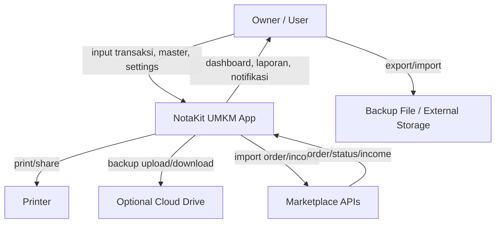
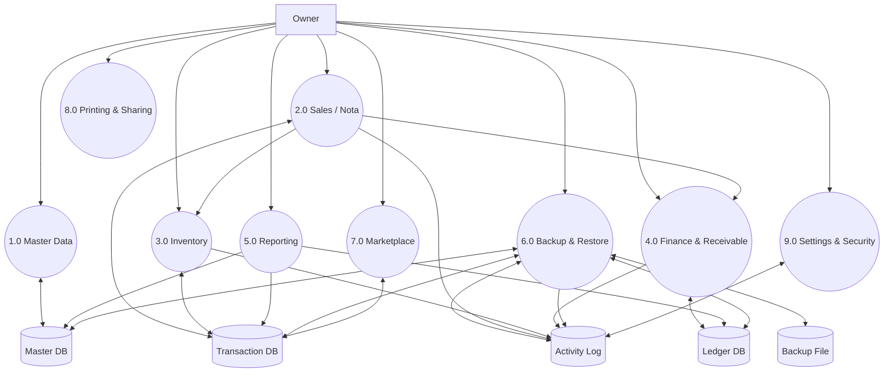
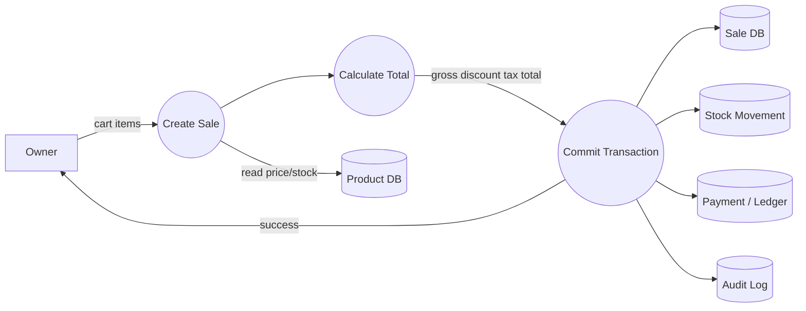
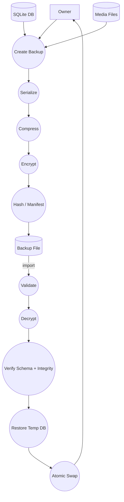

# NOTAKIT — Data Flow Diagram (DFD) & Core Workflows

# 11. Data Flow Diagram (DFD)

## 11.1 Context Diagram



## 11.2 DFD Level 0



## 11.3 DFD Penjualan



## 11.4 DFD Backup



---

# 12. Core Workflow

## 12.1 Penjualan Normal

```text
Open App
 -> Unlock
 -> New Sale
 -> Select Customer (optional)
 -> Scan/Search Product
 -> Select Unit/Variant
 -> Set Qty
 -> Apply Price Tier
 -> Apply Discount
 -> Apply Tax/Service Fee
 -> Payment
 -> Finalize
 -> Atomic commit
    -> Sale saved
    -> Stock movement created
    -> Payment ledger created
    -> Receivable created if needed
    -> Activity log created
 -> Print/Share
```

## 12.2 Pindah HP

```text
HP Lama
  -> Settings
  -> Backup / Export
  -> Full Backup
  -> Encrypt with password
  -> Generate .NotaKitbackup
  -> transfer via cable/Drive/Share

HP Baru
  -> Install app
  -> Import backup
  -> Enter password
  -> Validate
  -> Preview data counts
  -> Confirm restore
  -> Restore
  -> Rebuild indexes/cache
  -> Verify reports
```

---
