# NOTAKIT — Entity Relationship Diagram & Database Design (ERD)

# 7. ERD

## 7.1 Entitas Utama

```mermaid
 erDiagram
    OWNER ||--|| BUSINESS : owns
    BUSINESS ||--o{ CATEGORY : has
    BUSINESS ||--o{ UNIT : defines
    BUSINESS ||--o{ PRODUCT : owns
    PRODUCT ||--o{ PRODUCT_VARIANT : has
    PRODUCT ||--o{ PRODUCT_UNIT : supports
    UNIT ||--o{ PRODUCT_UNIT : maps
    BUSINESS ||--o{ SUPPLIER : has
    BUSINESS ||--o{ CUSTOMER_TYPE : has
    CUSTOMER_TYPE ||--o{ CUSTOMER : groups
    BUSINESS ||--o{ CUSTOMER : has
    BUSINESS ||--o{ SALESMAN : has
    SALESMAN ||--o{ CUSTOMER : handles
    BUSINESS ||--o{ PRICE_TIER : has
    PRICE_TIER ||--o{ PRODUCT_PRICE : defines
    PRODUCT ||--o{ PRODUCT_PRICE : priced
    CUSTOMER_TYPE ||--o{ PRODUCT_PRICE : can_use
    CUSTOMER ||--o{ CUSTOMER_PRICE : overrides
    PRODUCT ||--o{ CUSTOMER_PRICE : overrides
    BUSINESS ||--o{ SALE : creates
    CUSTOMER ||--o{ SALE : buys
    SALESMAN ||--o{ SALE : handles
    SALE ||--|{ SALE_LINE : contains
    PRODUCT ||--o{ SALE_LINE : sold_as
    PRODUCT_VARIANT ||--o{ SALE_LINE : variant
    SALE ||--o{ PAYMENT : receives
    ACCOUNT ||--o{ PAYMENT : receives_into
    SALE ||--o{ RECEIVABLE : creates
    CUSTOMER ||--o{ RECEIVABLE : owes
    RECEIVABLE ||--o{ RECEIVABLE_PAYMENT : settled_by
    PAYMENT ||--o{ RECEIVABLE_PAYMENT : applied
    BUSINESS ||--o{ ACCOUNT : owns
    ACCOUNT ||--o{ LEDGER_ENTRY : posts
    BUSINESS ||--o{ EXPENSE : records
    PRODUCT ||--o{ STOCK_MOVEMENT : moves
    BUSINESS ||--o{ STOCK_MOVEMENT : owns
    SALE ||--o{ STOCK_MOVEMENT : causes
    SUPPLIER ||--o{ PURCHASE : supplies
    PURCHASE ||--|{ PURCHASE_LINE : contains
    PRODUCT ||--o{ PURCHASE_LINE : purchased
    PURCHASE ||--o{ PURCHASE_PAYMENT : paid_by
    ACCOUNT ||--o{ PURCHASE_PAYMENT : paid_from
    BUSINESS ||--o{ SALES_RETURN : receives
    SALE ||--o{ SALES_RETURN : references
    SALES_RETURN ||--|{ SALES_RETURN_LINE : contains
    PRODUCT ||--o{ SALES_RETURN_LINE : returned
    BUSINESS ||--o{ ACTIVITY_LOG : records
    BUSINESS ||--o{ BACKUP_RECORD : creates
    BUSINESS ||--o{ MARKETPLACE_ACCOUNT : connects
    MARKETPLACE_ACCOUNT ||--o{ MARKETPLACE_ORDER : imports
    MARKETPLACE_ORDER ||--|{ MARKETPLACE_ORDER_LINE : contains
    PRODUCT ||--o{ MARKETPLACE_ORDER_LINE : maps
    BUSINESS ||--o{ APP_SETTING : configures
    BUSINESS ||--o{ PRINTER_PROFILE : configures
    BUSINESS ||--o{ NOTIFICATION : receives
```



## 7.2 Detail Field Schema

### OWNER
- id PK
- name
- phone
- email
- created_at
- updated_at

### BUSINESS
- id PK
- owner_id FK UNIQUE
- name
- address
- phone
- email
- logo_path
- currency
- timezone
- invoice_prefix
- invoice_sequence
- created_at
- updated_at

### CATEGORY
- id PK
- business_id FK
- parent_id nullable FK self
- name
- sort_order
- is_active
- created_at
- updated_at

### UNIT
- id PK
- business_id FK
- code
- name
- symbol
- decimal_scale
- is_active

### PRODUCT
- id PK
- business_id FK
- category_id FK nullable
- supplier_id FK nullable
- type ENUM(goods,service,non_stock)
- sku
- barcode nullable
- name
- description
- photo_path nullable
- video_path nullable
- base_unit_id FK
- cost_price
- sale_price
- wholesale_price nullable
- min_stock
- max_stock nullable
- weight nullable
- volume nullable
- shipping_note nullable
- marketplace_sku_tokopedia nullable
- marketplace_sku_tiktok nullable
- marketplace_sku_shopee nullable
- track_stock boolean
- is_active
- created_at
- updated_at
- archived_at nullable

### PRODUCT_VARIANT
- id PK
- product_id FK
- sku
- barcode nullable
- name
- cost_price nullable
- sale_price nullable
- stock_quantity
- is_active

### PRODUCT_UNIT
- id PK
- product_id FK
- unit_id FK
- conversion_to_base DECIMAL
- sale_price_override nullable
- purchase_price_override nullable

### CUSTOMER_TYPE
- id PK
- business_id FK
- name
- default_discount_type
- default_discount_value
- default_price_tier_id FK nullable
- default_payment_term_days
- is_active

### CUSTOMER
- id PK
- business_id FK
- customer_type_id FK nullable
- salesman_id FK nullable
- name
- address
- phone
- whatsapp
- email
- credit_limit
- payment_term_days
- notes
- is_active
- created_at
- updated_at

### SALESMAN
- id PK
- business_id FK
- code
- name
- phone
- is_active

### PRICE_TIER
- id PK
- business_id FK
- name
- priority
- is_active

### PRODUCT_PRICE
- id PK
- product_id FK
- price_tier_id FK nullable
- customer_type_id FK nullable
- unit_id FK nullable
- variant_id FK nullable
- min_qty nullable
- price
- valid_from
- valid_to nullable

### CUSTOMER_PRICE
- id PK
- customer_id FK
- product_id FK
- variant_id FK nullable
- unit_id FK nullable
- min_qty nullable
- price
- valid_from
- valid_to nullable

### SALE
- id PK
- business_id FK
- customer_id FK nullable
- salesman_id FK nullable
- number UNIQUE per business
- status ENUM(draft,open,partial,paid,void,returned,completed)
- sale_type ENUM(retail,wholesale,restaurant,online,minimarket)
- order_type nullable
- subtotal
- discount_total
- tax_total
- service_charge
- shipping_fee
- rounding
- grand_total
- paid_total
- due_total
- due_date nullable
- note
- created_at
- updated_at
- finalized_at nullable
- voided_at nullable

### SALE_LINE
- id PK
- sale_id FK
- product_id FK nullable
- variant_id FK nullable
- product_name_snapshot
- sku_snapshot
- unit_name_snapshot
- qty
- unit_price
- discount_amount
- tax_amount
- cost_price_snapshot
- line_total
- note

### PAYMENT
- id PK
- sale_id FK nullable
- purchase_id FK nullable
- account_id FK
- payment_method ENUM(cash,bank,ewallet,card,other)
- amount
- reference_number nullable
- paid_at
- note

### RECEIVABLE
- id PK
- sale_id FK UNIQUE
- customer_id FK
- original_amount
- paid_amount
- remaining_amount
- due_date
- status
- created_at
- closed_at nullable

### RECEIVABLE_PAYMENT
- id PK
- receivable_id FK
- payment_id FK
- amount_applied

### ACCOUNT
- id PK
- business_id FK
- name
- type ENUM(cash,bank,ewallet,other)
- account_number nullable
- opening_balance
- current_balance
- is_active

### LEDGER_ENTRY
- id PK
- account_id FK
- source_type
- source_id
- entry_type ENUM(debit,credit)
- amount
- occurred_at
- note

### EXPENSE
- id PK
- business_id FK
- account_id FK
- category
- amount
- occurred_at
- note

### STOCK_MOVEMENT
- id PK
- business_id FK
- product_id FK
- variant_id FK nullable
- sale_id FK nullable
- purchase_id FK nullable
- movement_type
- quantity_base
- unit_cost
- reference_number
- occurred_at
- note

### PURCHASE
- id PK
- business_id FK
- supplier_id FK nullable
- number
- status
- subtotal
- discount_total
- tax_total
- grand_total
- paid_total
- due_total
- note
- created_at
- finalized_at nullable

### PURCHASE_LINE
- id PK
- purchase_id FK
- product_id FK
- variant_id FK nullable
- qty
- unit_id FK
- unit_cost
- discount_amount
- line_total

### PURCHASE_PAYMENT
- id PK
- purchase_id FK
- account_id FK
- amount
- paid_at

### SALES_RETURN
- id PK
- business_id FK
- sale_id FK
- number
- reason
- total
- created_at

### SALES_RETURN_LINE
- id PK
- sales_return_id FK
- sale_line_id FK
- product_id FK
- variant_id FK nullable
- qty
- amount

### ACTIVITY_LOG
- id PK
- business_id FK
- actor_type ENUM(owner,system)
- action
- entity_type
- entity_id
- before_json nullable
- after_json nullable
- created_at
- device_id

### BACKUP_RECORD
- id PK
- business_id FK
- file_name
- format_version
- app_version
- encrypted boolean
- size_bytes
- checksum
- created_at
- source_device_id
- location_type ENUM(local,drive,share)

### MARKETPLACE_ACCOUNT
- id PK
- business_id FK
- provider
- account_name
- credential_ref
- is_active
- last_sync_at

### MARKETPLACE_ORDER
- id PK
- marketplace_account_id FK
- external_order_id
- external_status
- order_time
- customer_name_snapshot
- total_amount
- raw_payload_hash
- imported_at
- status

Unique constraint: `(marketplace_account_id, external_order_id)`.

### MARKETPLACE_ORDER_LINE
- id PK
- marketplace_order_id FK
- product_id FK nullable
- external_sku
- product_name_snapshot
- qty
- unit_price
- line_total

### APP_SETTING
- id PK
- business_id FK
- key UNIQUE per business
- value_json_encrypted
- updated_at

### PRINTER_PROFILE
- id PK
- business_id FK
- name
- printer_type
- paper_width
- connection_type
- connection_config_encrypted
- template_id
- is_default

### NOTIFICATION
- id PK
- business_id FK
- type
- title
- body
- reference_type nullable
- reference_id nullable
- is_read
- created_at

---

# 8. Database Rules

## 8.1 Money

Simpan uang sebagai integer minor units, bukan floating-point.

Contoh IDR:

`amount_minor = 125000`.

Jika mata uang memiliki decimal places, simpan `currency_scale` pada business/settings.

## 8.2 Quantity

Gunakan DECIMAL/FIXED precision agar mendukung:
- 0.5 kg;
- 1.25 liter;
- 2 dus.

## 8.3 Soft Delete

Master data memakai archive/soft delete. Data transaksi tidak boleh benar-benar dihapus setelah final.

---

# 15. Index & Constraint Strategy

Index minimum:

```text
products(business_id, name)
products(business_id, sku)
products(business_id, barcode)
products(business_id, is_active)
customers(business_id, name)
customers(business_id, phone)
sales(business_id, number)
sales(business_id, created_at)
sales(business_id, customer_id, created_at)
sale_lines(sale_id)
stock_movements(product_id, occurred_at)
receivables(customer_id, status, due_date)
payments(paid_at)
ledger_entries(account_id, occurred_at)
marketplace_orders(account_id, external_order_id) UNIQUE
activity_logs(business_id, created_at)
```

Foreign key enforcement wajib aktif.

---

# 17. Accounting / HPP Rules

Untuk laporan laba sederhana:

`Gross Profit = Sales Net - COGS`

`Net Profit = Gross Profit - Operating Expenses`

COGS saat penjualan:

`COGS = Σ(qty_base × cost_price_snapshot)`

Gunakan cost snapshot pada sale line untuk histori, dan gunakan inventory costing policy yang konsisten.

MVP dapat memakai **weighted average cost**.

Weighted average:

`new_avg = ((old_qty × old_cost) + (purchase_qty × purchase_cost)) / (old_qty + purchase_qty)`

Untuk metode FIFO/perpetual costing, dapat disiapkan pada Phase 3.

---
