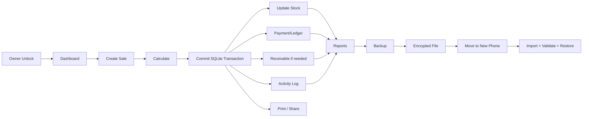

# NOTAKIT — Product Requirements Document (PRD)

# 1. Product Requirements Document (PRD)

## 1.1 Tujuan Produk

Membangun aplikasi POS/nota dan manajemen usaha UMKM yang:

1. Dapat dipakai tanpa akun cloud dan tanpa subscription.
2. Menyimpan data utama di perangkat pengguna.
3. Tetap berfungsi ketika offline.
4. Mendukung toko retail, grosir, minimarket, restoran/cafe, laundry, bengkel, dan usaha jasa.
5. Mengelola transaksi, produk, pelanggan, stok, piutang, kas, laporan, pencetakan, dan backup.
6. Memungkinkan pindah HP secara mandiri melalui file backup.
7. Memiliki keamanan lokal sehingga database dan backup dapat dienkripsi.
8. Memiliki integrasi jaringan sebagai fitur opsional, bukan ketergantungan core app.

## 1.2 Sasaran Pengguna

### Persona utama

**Owner UMKM tunggal** yang memakai satu aplikasi untuk operasional toko/usaha.

Kebutuhan utama:
- membuat nota cepat;
- mengetahui omzet dan laba;
- memantau stok;
- mengelola pelanggan dan piutang;
- mencetak/share nota;
- backup dan pindah perangkat;
- melihat laporan tanpa server sendiri.

### Persona usaha

- toko retail;
- grosir/distributor kecil;
- minimarket;
- restoran/cafe;
- laundry;
- bengkel;
- usaha jasa;
- toko online/omnichannel.

## 1.3 Prinsip Produk

- **Local-first:** database lokal adalah source of truth utama.
- **Offline-first:** transaksi utama tidak membutuhkan internet.
- **Single-owner:** satu profil owner dan satu business workspace.
- **No subscription:** tidak ada paket bulanan/tahunan.
- **Portable data:** seluruh data dapat di-export/import.
- **Recoverable:** backup otomatis/manual dan restore harus menjadi fitur kelas satu.
- **Auditability:** perubahan penting tercatat dalam activity log.
- **Idempotency:** import order dan restore tidak boleh menggandakan data.
- **Extensible:** marketplace/printer dapat memakai adapter/plugin internal.

## 1.4 Ruang Lingkup Fitur

### A. Dashboard & Ringkasan

- omzet hari ini;
- omzet periode;
- jumlah transaksi;
- transaksi lunas;
- piutang belum lunas;
- laba kotor;
- laba bersih;
- produk terlaris;
- stok bernilai;
- arus kas;
- shortcut transaksi cepat;
- notifikasi stok menipis;
- notifikasi piutang jatuh tempo;
- notifikasi order masuk (jika integrasi aktif).

### B. Penjualan / Nota

- daftar nota;
- buat nota;
- edit nota;
- hapus/cancel nota dengan proteksi;
- nomor nota otomatis/custom prefix;
- tanggal & jam;
- pelanggan;
- salesman;
- item barang/jasa/non-item;
- qty;
- satuan;
- harga;
- harga grosir;
- diskon nominal;
- diskon persentase;
- diskon bertingkat;
- pajak opsional;
- biaya tambahan;
- biaya pengiriman;
- pembulatan;
- total;
- pembayaran;
- multi-metode pembayaran;
- status lunas/sebagian/belum lunas;
- jatuh tempo;
- memo/catatan;
- nota konsinyasi;
- void/return/refund;
- riwayat perubahan;
- share nota;
- cetak nota;
- duplicate/repeat order.

### C. Produk / Item

- tipe: barang, jasa, non-stock/non-item;
- nama;
- kode/SKU;
- barcode;
- kategori;
- subkategori opsional;
- foto;
- video opsional;
- satuan utama;
- satuan alternatif;
- konversi satuan;
- harga beli/modal;
- harga jual;
- harga grosir;
- tier harga;
- harga berdasarkan tipe pelanggan;
- varian;
- stok;
- minimum stok;
- stok maksimum opsional;
- pemasok;
- berat;
- volume;
- detail pengiriman;
- SKU Tokopedia;
- SKU TikTok Shop;
- SKU Shopee;
- status aktif/nonaktif;
- catatan;
- histori harga.

### D. Inventory

- stok masuk;
- stok keluar;
- stok karena penjualan;
- stok karena retur;
- penyesuaian stok;
- stock opname;
- transfer stok antar lokasi (opsional masa depan);
- kartu stok;
- stok minimum;
- notifikasi stok rendah;
- nilai stok;
- HPP/COGS;
- histori pergerakan stok;
- supplier;
- pembelian/receiving sederhana;
- biaya pembelian;
- batch/lot opsional;
- expiry opsional untuk usaha tertentu.

### E. Pelanggan

- master pelanggan;
- nama;
- alamat;
- telepon;
- WhatsApp;
- email;
- tipe pelanggan;
- salesman;
- limit piutang;
- termin pembayaran;
- saldo piutang;
- jatuh tempo;
- histori transaksi;
- histori pembayaran;
- catatan;
- status aktif/nonaktif.

### F. Supplier

- master supplier;
- kontak;
- alamat;
- telepon;
- email;
- catatan;
- histori pembelian;
- saldo hutang opsional;
- status aktif/nonaktif.

### G. Tipe Pelanggan & Harga

- tipe pelanggan;
- harga retail;
- harga grosir;
- tier harga;
- harga khusus pelanggan;
- diskon default;
- termin default.

### H. Salesman

- master salesman;
- nama;
- telepon;
- status;
- pelanggan yang ditangani;
- transaksi berdasarkan salesman;
- omzet per salesman;
- laba per salesman.

### I. Restoran / Cafe

- mode menu;
- kategori menu;
- item menu;
- varian/topping;
- meja;
- status meja;
- order dine-in/takeaway/delivery;
- split bill;
- merge bill;
- kitchen note;
- cetak order dapur opsional;
- service charge opsional;
- pajak;
- status order.

### J. Minimarket

- kasir cepat;
- scan barcode;
- pencarian cepat;
- shortcut kategori;
- hold/resume transaction;
- multi-payment;
- harga khusus;
- cetak struk;
- retur sederhana;
- stok realtime lokal.

### K. Marketplace & Online Order

Fitur yang harus disiapkan sebagai adapter, dengan core data tetap lokal:

- NotaKit Online Order;
- order masuk;
- status order;
- notifikasi order;
- Tokopedia import order;
- Tokopedia import income;
- TikTok Shop import order;
- TikTok Shop import income;
- Shopee import order;
- Shopee import income;
- mapping SKU marketplace;
- deduplikasi order berdasarkan external order ID;
- sinkronisasi manual;
- log integrasi;
- retry/error queue.

> API resmi marketplace dapat berubah. Implementasi connector harus dipisahkan dari domain core dan diberi feature flag.

### L. Laporan

- dashboard summary;
- omzet;
- penjualan harian;
- penjualan per periode;
- penjualan per produk;
- produk terlaris;
- penjualan per kategori;
- penjualan per pelanggan;
- penjualan per tipe pelanggan;
- penjualan per salesman;
- penjualan per metode pembayaran;
- laba kotor;
- laba bersih;
- HPP;
- arus kas;
- nilai stok;
- stok rendah;
- piutang;
- umur piutang;
- pembelian;
- retur;
- analisa penjualan;
- grafik penjualan;
- grafik laba;
- riwayat aktivitas.

### M. Keuangan Sederhana

- akun kas;
- rekening bank;
- akun pembayaran digital;
- pemasukan;
- pengeluaran;
- transfer antar akun;
- saldo akun;
- piutang;
- pembayaran piutang;
- hutang supplier opsional;
- biaya operasional;
- arus kas;
- rekonsiliasi saldo sederhana.

### N. Printer & Output

Target printer/output:

- thermal 58 mm;
- thermal 80 mm;
- Wi-Fi/network printer A4;
- dot matrix continuous form;
- USB/OTG jika driver/OS mendukung;
- Bluetooth printer jika plugin mendukung;
- PDF;
- image/share;
- WhatsApp;
- email;
- share sheet OS;
- template nota configurable.

### O. Data Management

- export Excel/CSV untuk laporan;
- export full backup JSON;
- export backup terkompresi;
- export backup terenkripsi;
- import backup;
- validate backup;
- preview backup sebelum restore;
- restore penuh;
- restore parsial;
- backup manual;
- backup terjadwal lokal;
- Google Drive backup opsional;
- share backup file;
- checksum/integrity verification;
- versioned backup schema;
- migrasi schema otomatis.

### P. Keamanan & Proteksi

- app lock PIN;
- biometrik;
- PIN untuk operasi sensitif;
- proteksi edit/hapus nota;
- database encryption;
- backup encryption;
- key derivation dari passphrase/PIN;
- secure key storage melalui OS keystore/keychain;
- auto-lock;
- audit log;
- secure delete untuk file sementara;
- ekspor dengan password;
- import dengan password;
- recovery code opsional.

### Q. Pengaturan Toko

- profil toko;
- nama toko;
- alamat;
- telepon;
- email;
- logo;
- footer nota;
- prefix nomor nota;
- format nomor;
- default pajak;
- default diskon;
- mata uang;
- format tanggal/jam;
- pembulatan;
- bahasa;
- tema;
- format printer;
- template nota;
- preferensi stok;
- preferensi harga;
- preferensi pembayaran.

### R. Cloud / Multi-device Opsional

Karena aplikasi target tidak memakai subscription, multi-device tidak menjadi source of truth utama. Implementasi yang disarankan:

- ekspor/import sebagai mekanisme utama pindah perangkat;
- cloud backup opsional ke Google Drive/S3-compatible storage;
- sinkronisasi real-time opsional masa depan;
- konflik data diselesaikan dengan versioning/event timestamp.

---

# 2. Non-Goals

- multi-tenant SaaS;
- subscription billing;
- user marketplace umum;
- sistem payroll lengkap;
- akuntansi double-entry penuh pada MVP;
- ERP penuh;
- server wajib untuk transaksi lokal.

---

# 3. Success Criteria

1. Pengguna dapat membuat nota dalam ≤ 30 detik setelah master data siap.
2. Transaksi inti tetap berfungsi tanpa internet.
3. Tidak ada kehilangan data setelah force-close/restart dalam transaksi yang sudah committed.
4. Backup dapat direstore ke perangkat kedua tanpa server developer.
5. Restore 10.000 transaksi tidak menggandakan data.
6. Laporan menggunakan source transaksi yang sama sehingga angka dapat ditelusuri ke nota.
7. Semua perubahan sensitif masuk audit log.
8. Export full backup dapat dire-import pada versi aplikasi berikutnya melalui schema migration.

---

# 4. Scope MVP vs Phase 2

## MVP (wajib)

- onboarding owner;
- profil toko;
- produk/item;
- kategori;
- satuan & konversi;
- pelanggan & tipe pelanggan;
- supplier;
- salesman;
- harga grosir/tier;
- penjualan/nota;
- pembayaran;
- piutang;
- stok;
- penyesuaian stok;
- laporan dasar;
- kas/bank;
- print 58/80 mm + PDF/share;
- export/import full backup;
- backup terenkripsi;
- app lock;
- audit log;
- settings.

## Phase 2

- restoran/cafe mode;
- minimarket mode lanjutan;
- purchase workflow;
- retur penjualan/pembelian lanjutan;
- stock opname lanjutan;
- Google Drive backup;
- online order;
- marketplace adapters;
- kitchen printing;
- advanced analytics.

## Phase 3

- optional cross-device sync;
- advanced accounting;
- advanced inventory batch/expiry;
- plugin connector marketplace.

---

# 28. Reference Feature Completeness

Fitur pembanding yang wajib tercakup dari NotaKit publik:

- [x] Daftar nota & omzet
- [x] Piutang / nota belum lunas
- [x] Barang & harga
- [x] Produk terlaris
- [x] Diskon biasa
- [x] Diskon bertingkat
- [x] Thermal 58 mm
- [x] Thermal 80 mm
- [x] Wi-Fi/A4
- [x] Dot matrix continuous form
- [x] Share WhatsApp/email/other
- [x] Export Excel
- [x] Grafik penjualan
- [x] Grafik laba
- [x] Pelanggan
- [x] Tipe pelanggan
- [x] Salesman
- [x] Varian
- [x] Harga grosir
- [x] Konversi satuan
- [x] Mode restoran/cafe
- [x] Mode minimarket
- [x] NotaKit Online Order
- [x] Tokopedia import order/income
- [x] TikTok Shop import order/income
- [x] Shopee import order/income
- [x] Berat produk
- [x] Volume produk
- [x] Video produk
- [x] Notifikasi pesanan
- [x] Analisa penjualan

Sumber pembanding tersebut berasal dari daftar fitur dan changelog yang terlihat di Google Play pada 25 Agustus 2026. citeturn956920view0

---

# 29. Product Decision untuk Versi Personal

Karena aplikasi ini hanya untuk **satu owner dan satu usaha**:

- tidak perlu tenant_id;
- tidak perlu billing/subscription tables;
- tidak perlu role/permission matrix kompleks;
- tidak perlu authentication server;
- tidak perlu server untuk core transaksi;
- local database menjadi sumber data utama;
- owner ID tunggal dapat disimpan sebagai singleton;
- backup file menjadi mekanisme resmi device migration.

Namun desain database tetap memakai `business_id` pada entity karena hal tersebut memudahkan konsistensi domain dan migrasi masa depan, walaupun hanya satu business instance yang aktif.

---

# 31. Final Build Target

Pada akhirnya aplikasi harus dapat memenuhi alur berikut tanpa server:

**Prinsip akhir:** transaksi lokal tetap berjalan tanpa internet; internet hanya digunakan oleh fitur yang memang membutuhkan jaringan (marketplace/cloud/optional online order). Tidak ada subscription, tidak ada tenant billing, dan data dapat dipindahkan secara mandiri lewat backup terenkripsi.
