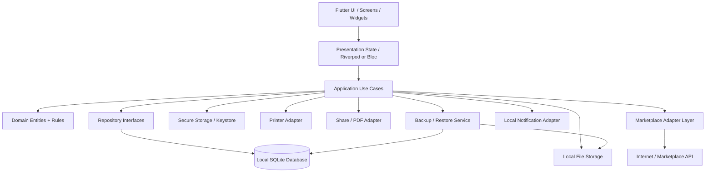
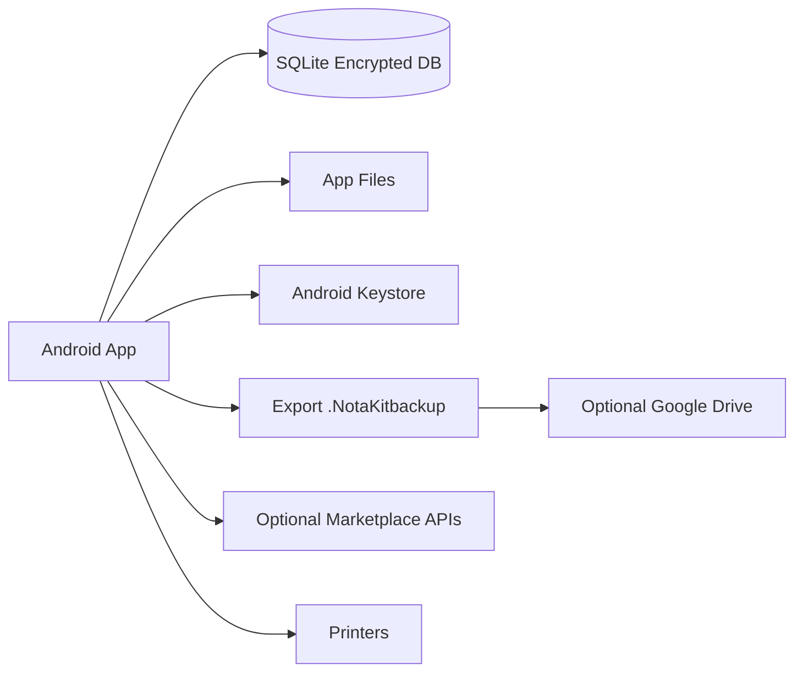
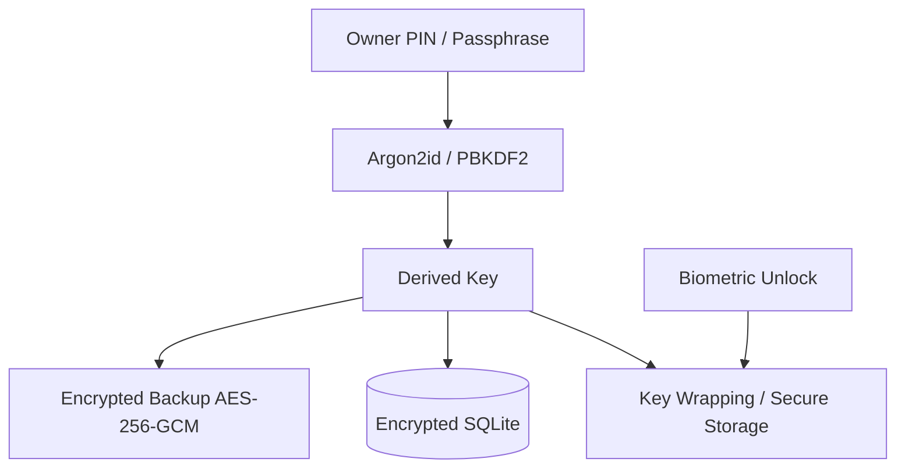

# NOTAKIT — System Architecture

# 9. System Architecture

## 9.1 Arsitektur Logical



## 9.2 Flutter Layering

Direkomendasikan struktur:

```text
lib/
├── app/
│   ├── app.dart
│   ├── router.dart
│   ├── theme/
│   └── bootstrap/
├── core/
│   ├── error/
│   ├── result/
│   ├── money/
│   ├── date_time/
│   ├── security/
│   ├── database/
│   ├── backup/
│   ├── printing/
│   ├── files/
│   └── logging/
├── features/
│   ├── dashboard/
│   ├── sales/
│   ├── products/
│   ├── inventory/
│   ├── customers/
│   ├── suppliers/
│   ├── salesmen/
│   ├── pricing/
│   ├── purchases/
│   ├── receivables/
│   ├── finance/
│   ├── reports/
│   ├── restaurants/
│   ├── minimarket/
│   ├── marketplace/
│   ├── printing/
│   ├── backup_restore/
│   ├── settings/
│   ├── security/
│   └── activity_log/
└── shared/
    ├── widgets/
    ├── formatters/
    └── extensions/
```

## 9.3 Recommended Flutter Stack

- Flutter + Dart;
- Riverpod atau Bloc untuk state management;
- Drift atau Isar untuk persistence, dengan **Drift + SQLite** sebagai pilihan utama untuk transaksi relational kompleks;
- Freezed/json_serializable untuk immutable models/serialization;
- go_router untuk navigation;
- flutter_secure_storage untuk secret/key wrapping;
- local_auth untuk biometric;
- path_provider untuk local paths;
- share_plus untuk sharing;
- pdf + printing untuk PDF/A4/rendering;
- mobile_scanner atau barcode scanning plugin;
- local_notifications package untuk local notification.

> Pilih satu stack state-management dan satu database layer pada implementasi; jangan mencampur dua ORM/database utama.

---

# 10. Deployment Architecture



Core transaksi tidak tergantung G atau P.

---

# 13. Backup File Specification

## 13.1 Format Container

Disarankan memakai ZIP-like container dengan manifest, tetapi **payload database tetap terenkripsi**.

```text
NOTAKIT_BACKUP/
├── manifest.json
├── database.sqlite.enc
├── media/
│   ├── images.enc
│   └── videos.enc
└── checksum.json
```

Untuk security lebih baik, seluruh archive dapat dienkripsi sebagai satu blob:

```text
.NotaKitbackup
└── AEAD encrypted container
```

## 13.2 Manifest

```json
{
  "format": "NotaKit-backup",
  "version": 1,
  "app_version": "1.0.0",
  "schema_version": 1,
  "created_at": "2026-01-01T00:00:00Z",
  "business_name": "Example Store",
  "encrypted": true,
  "compression": "zstd-or-deflate",
  "cipher": "AES-256-GCM",
  "kdf": "Argon2id",
  "record_counts": {
    "products": 0,
    "customers": 0,
    "sales": 0,
    "stock_movements": 0
  }
}
```

Jangan menaruh PIN/password di manifest.

---

# 14. Security Architecture



### Aturan penting

1. Password tidak disimpan plaintext.
2. DB key tidak diletakkan hard-coded di source.
3. Salt dan nonce harus random.
4. Authenticated encryption wajib diverifikasi sebelum decrypt result dipakai.
5. Export backup tanpa password diberi label **unencrypted** dan hanya tersedia jika user sengaja mengaktifkan opsi tersebut.
6. Default adalah encrypted backup.

---

# 18. UI / Information Architecture

```text
Dashboard
├── Ringkasan
├── Penjualan Hari Ini
├── Produk Terlaris
├── Piutang
└── Stok Rendah

Penjualan
├── Semua Nota
├── Belum Lunas
├── Retur
└── Buat Nota

Item
├── Semua Item
├── Kategori
├── Satuan
├── Harga Grosir
├── Varian
└── Supplier

Pelanggan
├── Pelanggan
├── Tipe Pelanggan
└── Salesman

Inventory
├── Stok
├── Stok Masuk
├── Penyesuaian
├── Stock Opname
└── Kartu Stok

Pembelian
├── Purchase
├── Supplier
└── Hutang (opsional)

Keuangan
├── Kas
├── Bank
├── Pemasukan
├── Pengeluaran
├── Piutang
└── Arus Kas

Laporan
├── Summary
├── Penjualan
├── Analisa Penjualan
├── Laba Penjualan
├── Laba Bersih
├── Produk Terlaris
├── Nilai Stok
├── Arus Kas
└── Riwayat Aktivitas

Marketplace
├── Online Order
├── Tokopedia
├── TikTok Shop
└── Shopee

Pengaturan
├── Toko Saya
├── Rekening Toko
├── Printer
├── Preferensi
├── Keamanan
├── Backup / Restore
├── Cloud Backup
└── Export / Import
```

---

# 19. API / Integration Boundary

Core tidak harus mempunyai HTTP API.

Untuk connector online, gunakan interface:

```dart
abstract interface class MarketplaceAdapter {
  Future<List<ExternalOrder>> fetchOrders(SyncCursor cursor);
  Future<List<ExternalIncome>> fetchIncome(SyncCursor cursor);
  Future<SyncResult> pushStatus(String externalOrderId, String status);
}
```

Implementasi:

```text
TokopediaAdapter
TikTokShopAdapter
ShopeeAdapter
OnlineOrderAdapter
```

Printer:

```dart
abstract interface class PrinterAdapter {
  Future<PrinterConnectionResult> connect();
  Future<void> printReceipt(ReceiptDocument document);
  Future<void> printA4(Document document);
}
```

---

# 24. Recommended Development Order

## Sprint 1

- project bootstrap;
- database;
- migration;
- owner/store;
- security;
- settings.

## Sprint 2

- category/unit;
- products;
- customer;
- supplier;
- salesman;
- pricing.

## Sprint 3

- cart;
- sale;
- payment;
- receipt;
- stock atomicity.

## Sprint 4

- inventory;
- purchase;
- receivable;
- finance ledger.

## Sprint 5

- reports;
- dashboard;
- activity log.

## Sprint 6

- PDF;
- 58/80 printer;
- sharing;
- barcode scanning.

## Sprint 7

- backup;
- encrypted migration;
- restore;
- schema versioning.

## Sprint 8

- restaurant mode;
- minimarket mode.

## Sprint 9

- marketplace adapter;
- online order;
- notifications.

## Sprint 10

- hardening;
- profiling;
- integration test;
- release build;
- migration test.

---

# 26. Catatan Implementasi Kritis

## 26.1 Jangan menjadikan UI sebagai business logic

Jangan menghitung laba, stok, diskon atau piutang hanya di widget. Semua aturan harus berada di domain/application layer.

## 26.2 Jangan menyimpan total tanpa source line

Total pada sale boleh di-cache, tetapi harus dapat direkonstruksi dari sale lines.

## 26.3 Jangan menghapus transaksi final

Gunakan void/return.

## 26.4 Semua stock movement harus auditable

Stok bukan sekadar angka `products.stock` yang diubah manual. Gunakan movement ledger lalu boleh memiliki cached balance.

## 26.5 Snapshot transaksi

Nama produk/harga/HPP/unit harus disalin ke sale line saat transaksi final agar histori stabil.

## 26.6 Backup bukan sekadar export tabel

Backup harus memiliki:
- schema version;
- migration compatibility;
- integrity check;
- encryption;
- media handling;
- transactional restore.

## 26.7 Marketplace jangan dicampur dengan core sales

External order harus masuk melalui staging/import layer. Setelah valid, baru diposting menjadi local sale.

---

# 30. Keputusan Teknis Final yang Disarankan

**Frontend:** Flutter/Dart  
**State management:** Riverpod  
**Architecture:** Clean Architecture + feature-first  
**Database:** Drift + SQLite  
**Local encryption:** SQLCipher-compatible solution atau database encryption layer yang stabil untuk Flutter  
**Secret storage:** Android Keystore via `flutter_secure_storage`  
**Biometric:** `local_auth`  
**Serialization:** JSON + generated models  
**Backup:** versioned encrypted container `.NotaKitbackup`  
**Crypto:** AES-256-GCM + Argon2id/PBKDF2  
**PDF:** `pdf` + `printing`  
**Sharing:** `share_plus`  
**Barcode:** Android-capable scanner plugin  
**Notifications:** local notification plugin  
**Cloud:** optional; backup-first, not required for core operation  
**Network integrations:** adapter based  
**Testing:** unit + integration + golden + migration/recovery tests

---
